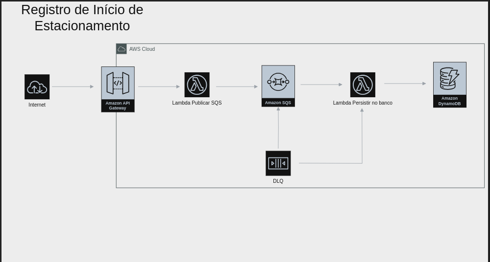
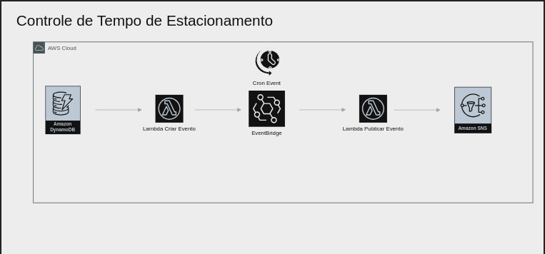
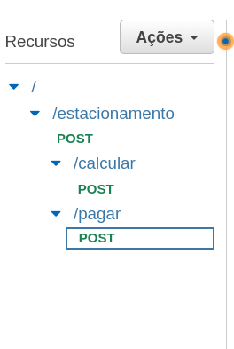
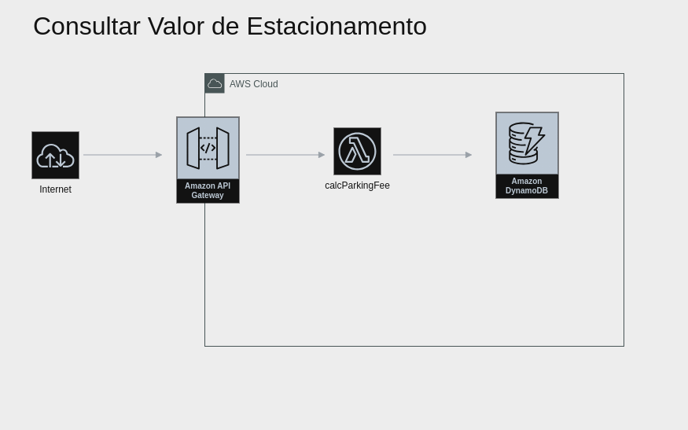
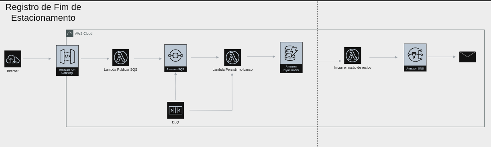

# TechChallenge 3

## Projeto do curso de Pós-Graduação da FIAP

## Grupo 50

- [Daniel Santiago](https://github.com/SantiagoDDaniel)
- [Kassiane Silva Mentz](https://github.com/kassimentz)
- [Leandro Paulino Costa](https://github.com/LeandroPC)
- [Luiz Felipe da Silva Santos](https://github.com/Felipe-3191)
- [Vitor Hugo Campos Alves](https://github.com/vitorAlves1992/)

## Fase 3 (29/08 até 06/11)

**Objetivos:**

- Documento de requisitos: [Documento de Requisitos](./Documentacao_Funcional_de_Sistema_de_Parquimetro.pdf)

   
**Entregáveis:**

Um **relatório PDF** que contenha as seguintes informações:

1. Link do GitHub com código-fonte dos serviços desenvolvidos
   - [Repositório CRUDs](https://github.com/Felipe-3191/TechChallenge3-CRUDS)
   - [Repositório Terraform + Lambdas](https://github.com/Felipe-3191/Techchallenge3-Estacionamento)
2. Documentação Técnica
3. Um Relatório Técnico descrevendo as tecnologias e ferramentas utilizadas, os desafios encontrados durante o desenvolvimento e as soluções implementadas para resolvê-los.
4. Para facilitar a demonstração de funcionamento da parte provisionada na nuvem, gravamos um vídeo em duas partes que pode ser acessado através desses links: 
   - [Parte 1](https://www.youtube.com/watch?v=dmy1nmNOqQw&ab_channel=Felipesantos)
   - [Parte 2](https://www.youtube.com/watch?v=MSDLe0Jj1TQ&ab_channel=Felipesantos)   


## Considerações Iniciais (Premissas)

Pressupomos que haverá uma aplicação mobile responsável por consumir os diversos serviços propostos por esse TechChallenge, portanto, essa aplicação será a fronteira e hipoteticamente os serviços serão consumidos apenas por essa aplicação, que conhecerá os métodos de acesso bem como considerará as questões de segurança e validações envolvidas.
Entedemos que como melhor prática, o Terraform criado deveria ser criado em módulos e estivesse ligado a uma esteira CI/CD, porém, respeitando o tempo e o escopo que nos foi passado, optamos por utilizar apenas um arquivo terraform, que irá provisionar toda a infraestrutura necessária


# Arquiteura da Aplicação - Serviços na nuvem 
## Consideções Iniciais 
Optamos por uma abordagem serverless de todos os serviços citados abaixo, como forma de demostrar uma aplicação de referência, criamos um terraform que exemplifica a arquitetura citada abaixo, por questões de custo e gerenciamento de escopo e tempo, há serviços que serão descritos abaixo que não serão providos por nosso terraform. 

Todos os horários são tratados como UTC, utilizando o Instant do Java, dessa maneira conseguimos garantir um bom nível de precisão em relação a hora.

Todos os registros são inseridos na tabela Estacionamento do DynamoDB (criada através do Terraform)

O projeto do Terraform em conjunto com as Lambdas implementadas pode ser encontrada nesse repositório: 
[Repositório Terraform + Lambdas](https://github.com/Felipe-3191/Techchallenge3-Estacionamento)
   Para facilitar a demonstração de funcionamento da parte provisionada na nuvem, gravamos um vídeo em duas partes que pode ser acessado através desses links: 
   - [Parte 1](https://www.youtube.com/watch?v=dmy1nmNOqQw&ab_channel=Felipesantos)
   - [Parte 2](https://www.youtube.com/watch?v=MSDLe0Jj1TQ&ab_channel=Felipesantos)

O Terraform acima provê os recursos bem como os papéis e roles necessários para acessá-los

### Tecnologias Utilizadas
- Aws Lambda (Java)
- DynamoDB
- SQS
- EventBridge
- CloudWatch 
- SNS
- APIGateway
- DynamoDB Streams

### Orientações para Implantação 

Será necessário:
 - Ter uma conta na AWS e ter o aws cli  instalado. 
 - Rodar o aws configure e preencher com a chave e secret gerados previamente
- Baixar cada Lambda e utilizar o maven para empacotar cada uma
- Alterar o arquivo main.tf para apontar pros jar's gerados em cada lambda.
- Os recursos serão provisionados na região **us-east-1** 


## Registro de Início de Estacionamento 

### Arquitetura Proposta




### Descrição da Arquitetura

As requisições serão recebidas pelo ApiGateway através do método POST no recurso Estacionamento, há um modelo de validação associado ao ApiGateway de forma que apenas Json's em conformidade com esse modelo serão aceitos.
 **O modelo:** 
```javascript
{
 "type":"object",
    "required": ["condutor","placaDoCarro","horariofixovar","formaPagamento"],
    "properties":{
        "condutor":{"type":"string"},
        "placaDoCarro":{"type":"string"},
        "horariofixovar":{"type":"string"}, #Especifica se o estacionamento é de horário fixo ou variável
        "formaPagamento":{"type":"string"},
        "emailContato":{"type":"string"},
        "tempoEstacionamentoFixo":{"type":"integer"}
    },
    "required":["condutor","placaDoCarro","horariofixovar","formaPagamento"],
    "title":"registroDeEntrada"
}
```
**Exemplos válidos:**
```javascript
{
  "condutor" : "felipe cred",
  "formaPagamento" : "credito",
  "horariofixovar" : "var",
  "emailContato": "teste@fiap.com",
  "placaDoCarro" : "LTS4252LP"
}
```
```javascript
{
  "condutor" : "felipe",
  "formaPagamento" : "pix",
  "horariofixovar" : "fixo",
  "emailContato": "teste@fiap.com",
  "tempoEstacionamentoFixo" : 4,
  "placaDoCarro" : "LTS4252LP"
}
```
Algumas considerações em relação ao modelo acima: 
  - O modelo contempla dois tipos distintos de controle de horário de estacionamento 
    - Horário Fixo: permite que a opção pix seja aceita como forma de pagamento, necessita que seja informado o tempo de permanencia em horas já no momento da inclusão (essas validações são realizadas pela Lambda que fará o registro da mensagem na fila)
    - Horário Variável: não permite que a opção pix seja recebida como forma de pagamento, não é necessário enviar o tempo de estacionamento

Após o modelo ser validado com sucesso, a Lambda [registrarRequisicaoFilaSQS](https://github.com/Felipe-3191/Techchallenge3-Estacionamento/tree/main/Lambdas/registrarRequisicaoFilaSQS) é invocada pelo ApiGateway e publica uma mensagem na fila de nome ***registro-entrada-estacionamento-queue***, o retorno dessa Lambda será o retorno do ApiGateway, portanto, optamos por gerar o UUID que identificará unicamente o registro nessa etapa e devolvê-lo como resposta no seguinte formato: 
```javascript
{"id":"8c3aec04-c83b-4fc4-b4a3-cf8832cba724"}
```
 O consumidor dessa fila será a Lambda [listenerSQSWriteDynamoLambda](https://github.com/Felipe-3191/Techchallenge3-Estacionamento/tree/main/Lambdas/listenerSQSWriteDynamoLambda) que escutará as mensagens da fila, as consumirá, computará valores como a data de entrada e realizará um "insert" no banco do DynamoDB. Finalizando assim o fluxo de registro de entrada no estacionamento. 

A Lambda listenerSQSWriteDynamoLambda tem tratamento diferente de acordo com a modalidade de controle de horário de estacionamento: 
 - Horário Fixo: Calcula e já insere no banco qual será o valor que deverá ser pago ao final do período de estacionamento 
 - Horário Variável: Apenas armazena a hora de entrada

 Conceitualmente foi adicionado ao modelo da arquitetura uma DLQ para que dessa forma seja possível realizar o devido tratamento de mensagens que por qualquer motivo obtiveram falhas em seu processamento. Esse recurso não foi implementado na prática por motivos de manter a implementação apenas como uma referência e para evitar maiores custos na AWS.

---


## Controle de Tempo Estacionado 



 Através do DynamoDB Streams, é possível reagir a inserções no DynamoDB, utilizando esse recurso, fizemos com que a inserção de um novo registro de estacionamento dispare uma reação (similar a uma trigger) que invocará uma nova Lambda.
 A Lambda [publishEventBridge](https://github.com/Felipe-3191/Techchallenge3-Estacionamento/tree/main/Lambdas/publishEventBridge) será invocada e, baseado na hora de registro do estacionamento, adicionará uma Task e um Target no EventBridge.
  - A Task nada mais é que uma tarefa agendada, o recurso aceita o agendamento no mesmo formato que a cron, portanto, a Lambda utiliza a data de entrada e (para fins de conceito), monta a string de uma cron que será executada em 5 minutos depois da data de registro de estacionamento
  - O Target é linkado na Task para que, ao chegar no período em que ela deverá ser executada, o Target será invocado por essa Task. Criamos uma nova Lambda que funcionará como Target. 
  
 A Lambda [listenerEventBridgeSendMessage](https://github.com/Felipe-3191/Techchallenge3-Estacionamento/tree/main/Lambdas/listenerEventBridgeSendMessage) idealmente irá publicar em um tópico SNS que por sua vez pode ter diversos listeners, como, por exemplo, um serviço de envio de email, um serviço de notificações push, etc. Para a demonstração do exercício, fizemos com que a lambda publicasse a mensagem no cloudwatch logs. Após a execução do código, a Lambda exclui o Target e a Task. 


  


### Calculo de Tempo Estacionado
O Fluxo de registro de fim do estacionamento é iniciado através de uma chamda com método POST ao método calcular do recurso estacionamento.


A chamada deve receber como body o id que representa o recurso
```javascript
{"id":"8c3aec04-c83b-4fc4-b4a3-cf8832cba724"}
```




A chamada desse método resultará na invocação da Lambda [calcParkingFee](https://github.com/Felipe-3191/Techchallenge3-Estacionamento/tree/main/Lambdas/calcParkingFee), que é responsável por calcular o valor do estacionamento da seguinte forma: 
- Horário Fixo: Não há o que calcular visto que a inserção do estacionamento a priori já realizou esse cálculo, uma vez que só é necessário saber qual é o valor do estacionamento (para fins do exercício esse valor está fixado em R$7,00) e multiplicar pela quantidade de horas informada.
- Horário Variável: A hora atual é subtraída da hora de entrada com o valor arredondado para cima e multiplicado pelo valor/hora (R$7,00)

Após o cálculo do valor, o mesmo é inserido na tabela Estacionamento do DynamoDB com o nome "valorEstacionamento". O retorno dessa Lambda é utilizado como resposta do ApiGateway, portanto, teremos algo como o modelo a seguir: 
```javascript
{
  "formaPagamento" : "pix",
  "valorEstacionamento" : 28,
  "condutor" : "felipe",
  "TicketId" : "04f268ee-a73b-467d-8f24-66c9efb6e814",
  "placaDoCarro" : "LTS4252LP",
  "emailContato" : "teste@fiap.com",
  "tempoEstacionamentoFixo" : 4,
  "horariofixovar" : "fixo",
  "PagamentoRealizado" : "N",
  "DataEntrada" : "2023-11-05T00:48:48.440Z"
}
```

Em seguida, para realizar o devido pagamento do estacionamento, deve-se realizar uma chamada POST ao método pagar do recurso estacionamento 


A chamada deve respeitar o seguinte modelo: 
```javascript
{"id":"8c3aec04-c83b-4fc4-b4a3-cf8832cba724",
 "valoraPagar" : 28
}
```
O seguinte fluxo será desencadeado



O ApiGateway invocará a Lambda [registrarPagamentoFilaSQS](https://github.com/Felipe-3191/Techchallenge3-Estacionamento/tree/main/Lambdas/registrarPagamentoFilaSQS) que, por sua vez, tem como principal função validar os dados e publicar a mensagem para a fila **park_pagamento_queue**.

Idealmente, essa fila seria consumida por algum serviço de pagamento e apenas após o pagamento prosseguiríamos com o fluxo, poreḿ, para fins didáticos, assumimos que o pagamento sempre será realizado com sucesso no valor correto. 

Sendo assim, A Lambda [listenerSQSWriteDynamoLambdaPagamento](https://github.com/Felipe-3191/Techchallenge3-Estacionamento/tree/main/Lambdas/listenerSQSWriteDynamoLambdaPagamento) receberá as mensagens da fila e persistirá no banco o valor pago

Novamente, optamos por encerrar o fluxo nesse momento, com a lambda utilizando o cloudwatch para logar a mensagem de "estacionamento pago com sucesso¨, mas exemplificamos no diagrama acima uma opção de fluxo "ideal"

---


---
